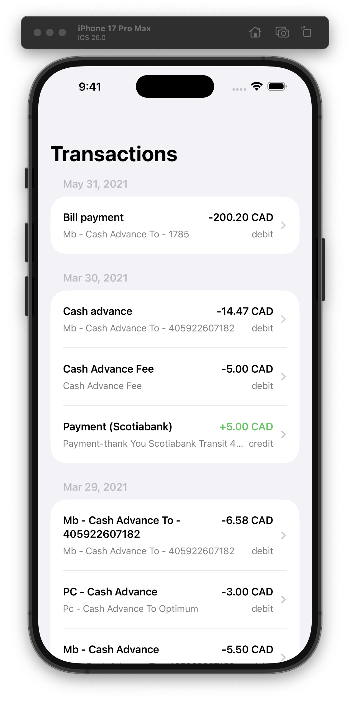
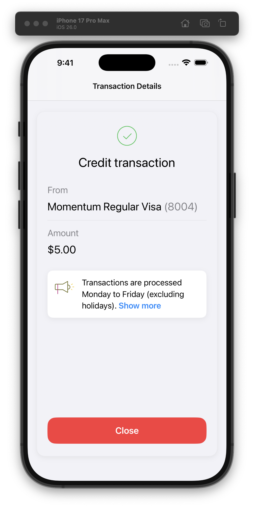
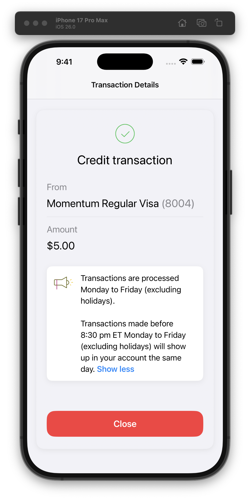
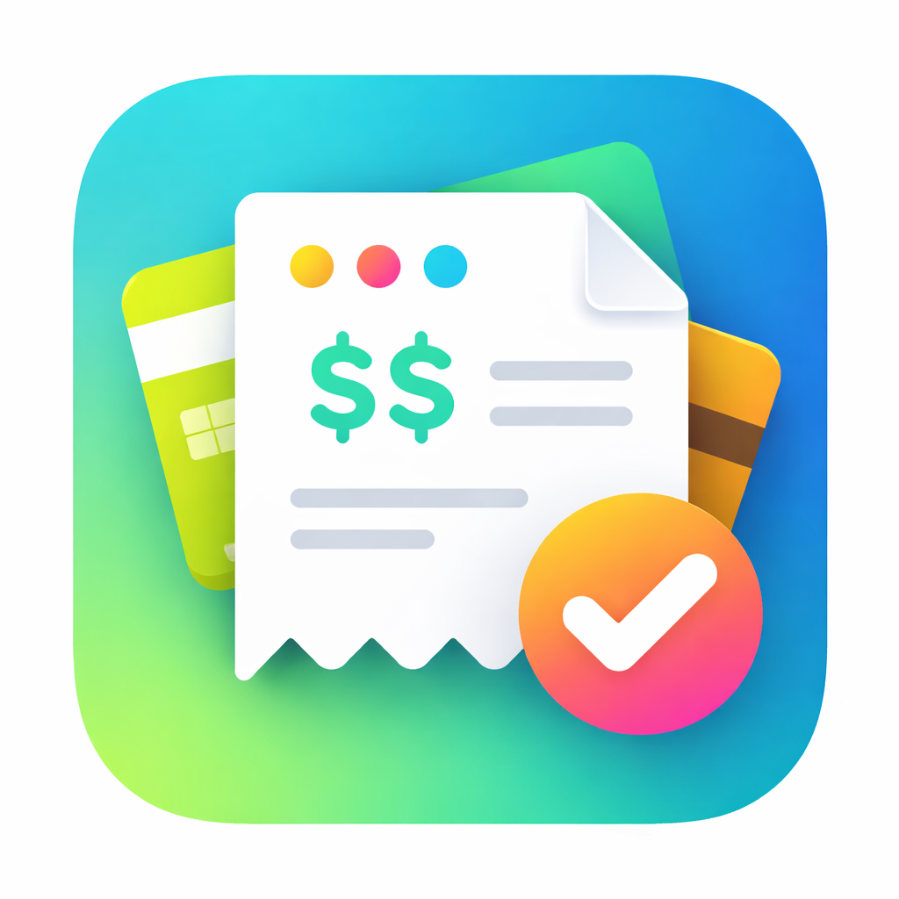
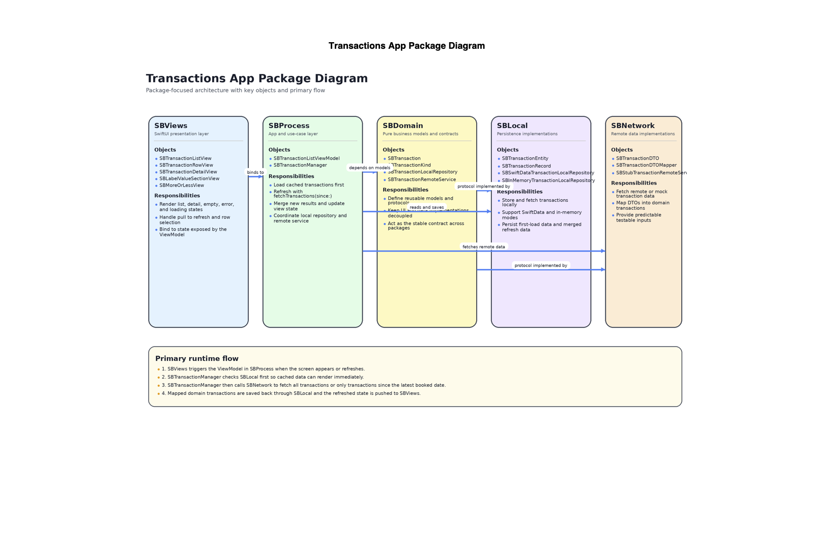
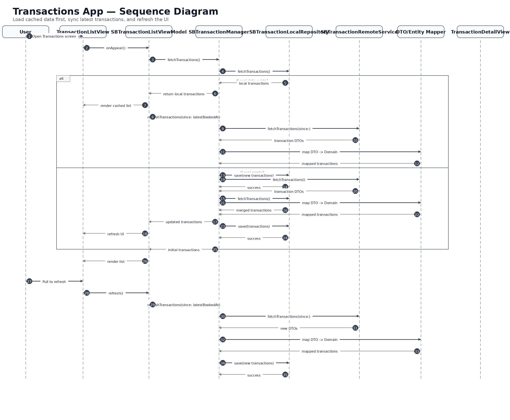
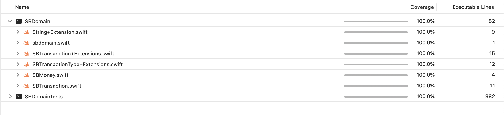
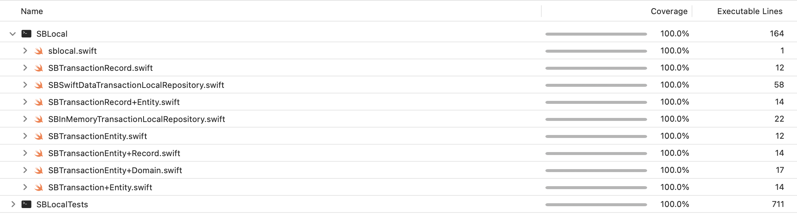
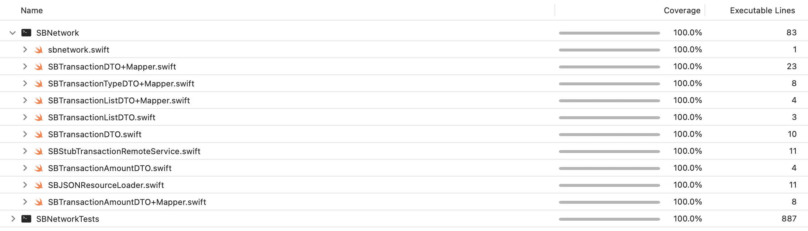
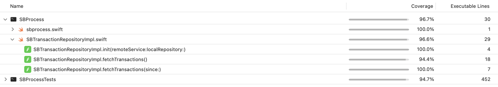

# 📱 Transactions App

A modern iOS Transactions app built with **clean architecture**, **modular Swift packages**, and a strong focus on **scalability, testability, and performance**.

---

## 📱 App Preview

### 🏠 Transactions List



---

### 📄 Transaction Details

| Collapsed                                               | Expanded                                                |
| ------------------------------------------------------- | ------------------------------------------------------- |
|  |  |

---

### 🎯 App Icon



---
## Demo Video

Transactions App Walkthrough

[Watch Demo](https://github.com/near22boju/transactions/blob/main/docs/video/transactions.mov)

---

## 🧠 Architecture Overview

This app follows a **layered modular architecture**:

```
SBViews → SBProcess → SBDomain → (SBLocal + SBNetwork)
```

---

## 🏗️ Architecture Diagram



📄 Full PDF: [View Architecture Diagram](docs/architecture.pdf)

---

## 🔄 Sequence Flow



**Highlights:**

* Fast initial load using cached data
* Incremental updates using `since` strategy
* Seamless UI refresh after sync

---

## 📦 Package Breakdown

### 🧩 Transactions App (Composition Layer)

* AppContainer, RootView, TransactionsApp
* SBTransactionManager
* Feature wiring and dependency injection

---

### 🎨 SBViews (UI Layer)

* Reusable SwiftUI components
* SBCardView, SBTransactionRowView
* SBLabelValueSection, SBMoreOrLessView
* SBPrimaryButton, SBSectionDivider

---

### 🔄 SBProcess (Orchestration Layer)

* SBTransactionRepositoryImpl
* Coordinates:

  * Local cache
  * Remote sync
* Acts as feature orchestration layer

---

### 📘 SBDomain (Core Layer)

* Pure models + contracts
* SBTransaction, SBMoney, SBTransactionType
* Repository + service protocols

---

### 💾 SBLocal (Persistence Layer)

* SwiftData + In-memory support
* Entity ↔ Domain ↔ Record mapping
* SBInMemoryTransactionLocalRepository
* SBSwiftDataTransactionLocalRepository

---

### 🌐 SBNetwork (Remote Layer)

* DTO models + mappers
* SBTransactionDTO, SBTransactionListDTO
* SBJSONResourceLoader
* SBStubTransactionRemoteService

---

## 🔄 Data Flow

1. UI triggers fetch via SBProcess
2. Local cache is used for immediate rendering
3. Remote fetch retrieves latest transactions
4. DTO → Domain mapping
5. Local storage updated
6. UI refreshes with latest state

---

## 🧪 Test Coverage

### 📊 Coverage Highlights

* SBDomain → 100%
* SBLocal → 100%
* SBNetwork → 100%
* SBProcess → ~96%

### 📸 Coverage Snapshots






---

## ⚙️ Key Design Principles

* ✅ Separation of concerns
* ✅ Dependency inversion
* ✅ Swappable implementations
* ✅ Test-first architecture
* ✅ Modular Swift Packages

---

## 🚀 Getting Started

### Requirements

* iOS 17+
* Xcode 26+

### Run the App

1. Clone the repository
2. Open in Xcode
3. Build and run

---

## 🔜 Future Improvements

* 🌐 Real API integration
* 🔎 Search & filtering
* 📄 Pagination
* 🌙 Dark mode polish
* 📊 Analytics & logging

---

## 💡 Why This Project?

This project demonstrates:

* Clean architecture in a real-world app
* Strong separation of layers
* Production-ready data flow design
* High test coverage with modular design

---

## 👨‍💻 Author

Sivakumar Boju
Toronto, Canada
